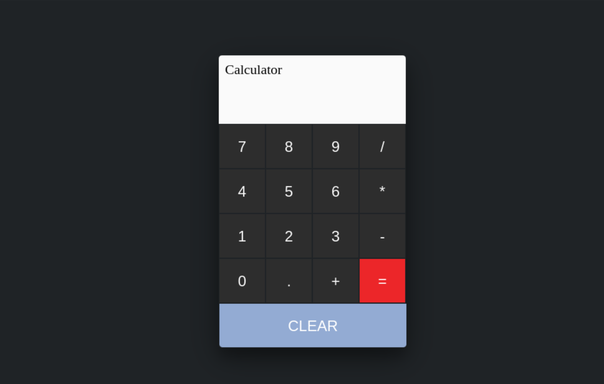

# JS_calculator
JavaScript calculator to perform basic mathamtic operations. 
You can easily use it in your local browser.
we used JavaScript, html and Css for creating this application.It is on basic stage right now and we'll welcome any features enhancement on it,
either more mathematical operations or design functionality which can make it more attractive.

